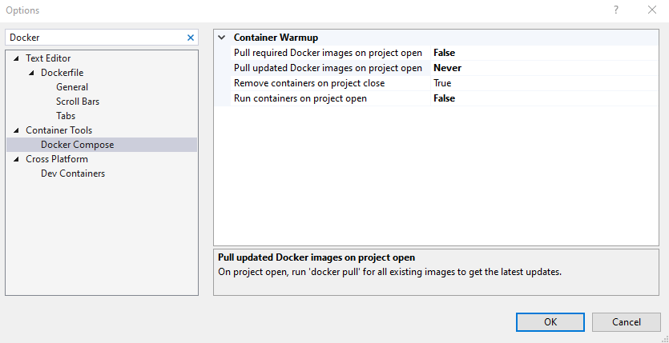

# AspNetMicroservices-StepByStep

RUN 
```docker-compose -f .\docker-compose.yml -f .\docker-compose.override.yml up -d```



ISSUES

## StackExchange.Redis.RedisServerException: ERR unknown command 'EVAL'

Using StackExchange.Redis as proposed in the course, I had error on UpdateBasket method:

```
StackExchange.Redis.RedisServerException: ERR unknown command 'EVAL'
   at Microsoft.Extensions.Caching.StackExchangeRedis.RedisCache.SetAsync(String key, Byte[] value, DistributedCacheEntryOptions options, CancellationToken token)
   at Basket.API.Repositories.BasketRepository.UpdateBasket(ShoppingCart basket) in C:\Users\caio.cruz\Pessoal\Projetos\AspnetMicroservices\src\Services\Basket\Basket.API\Repositories\BasketRepository.cs:line 30
```

To solve this, as a workaround, just to proceed with the course, I used another library to Redis connection: ServiceStack.Redis

## Environmet variables declaration on docker-compose.override.yml doesn't work properly

Instead of:
```
catalog.api:
    container_name: catalog.api
    environment:
      - ASPNETCORE_ENVIRONMENT=Development
      - "DatabaseSettings:ConnectionString=mongodb://catalogdb:27017"
    depends_on:
      - catalogdb
    ports:
      - "8000:80"
```

Try: 
```
catalog.api:
    container_name: catalog.api
    environment:
      - ASPNETCORE_ENVIRONMENT=Development
      - DatabaseSettings__ConnectionString=mongodb://catalogdb:27017
    depends_on:
      - catalogdb
    ports:
      - "8000:80"
```

By using __ (double underscore) in the environment variable names, Docker Compose will properly override the corresponding values in the appsettings.json file.
